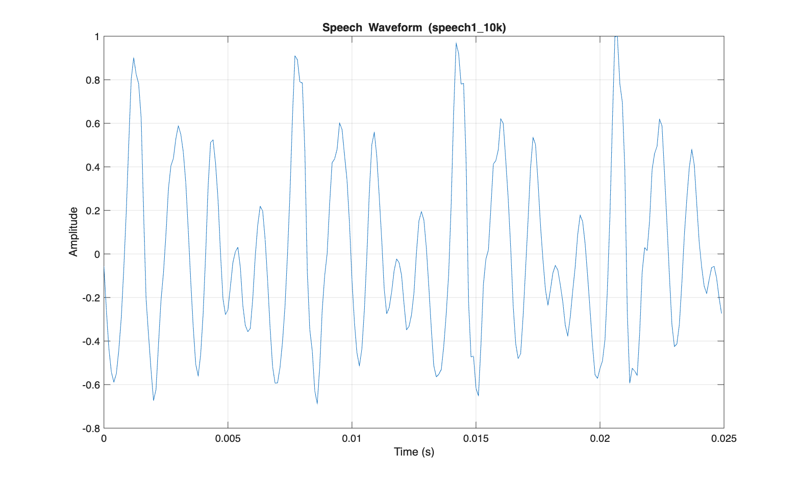
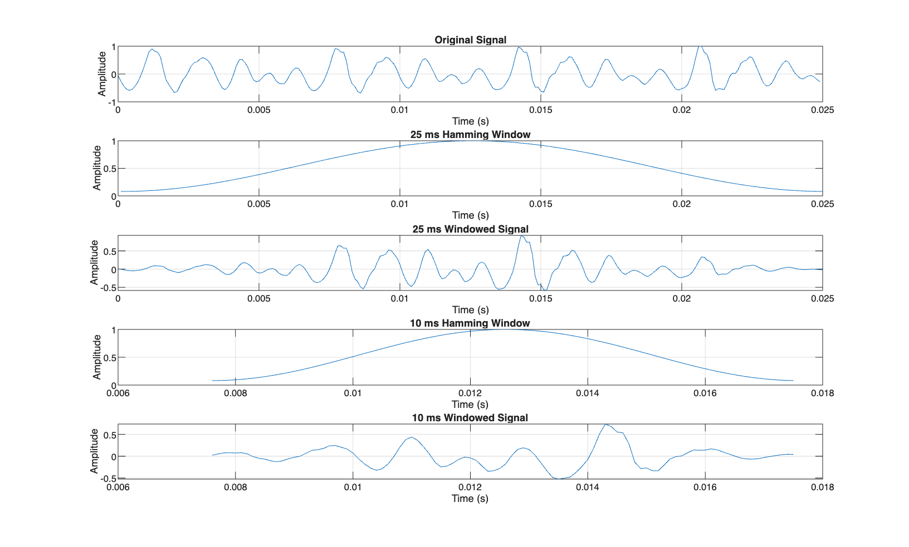
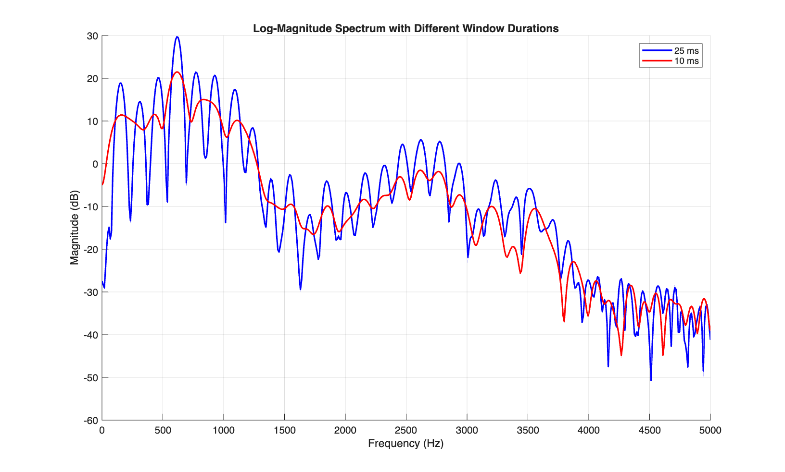
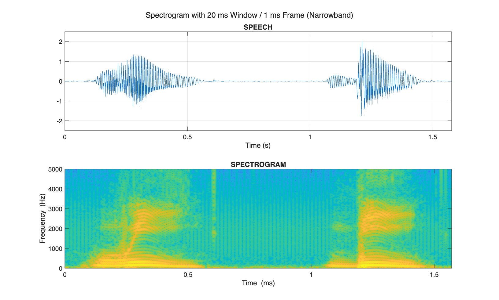
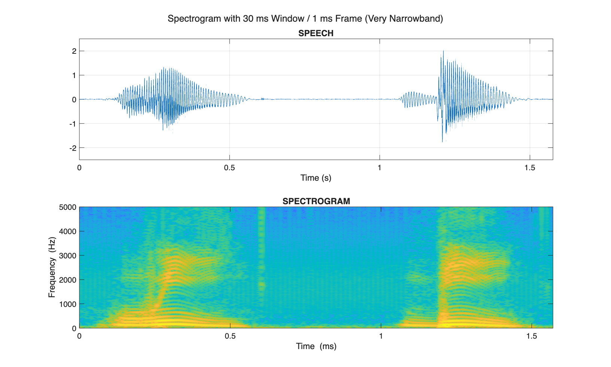
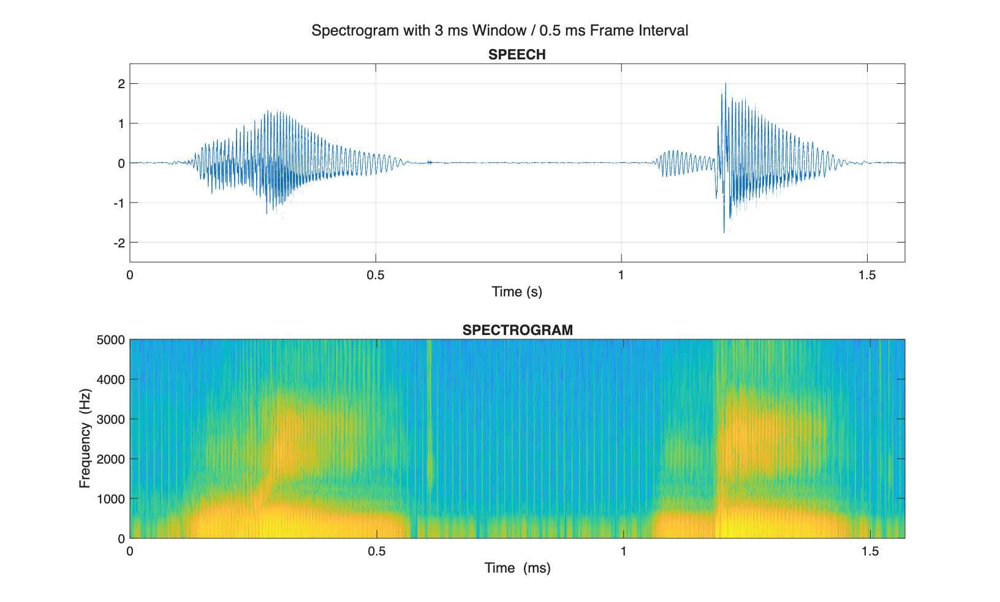
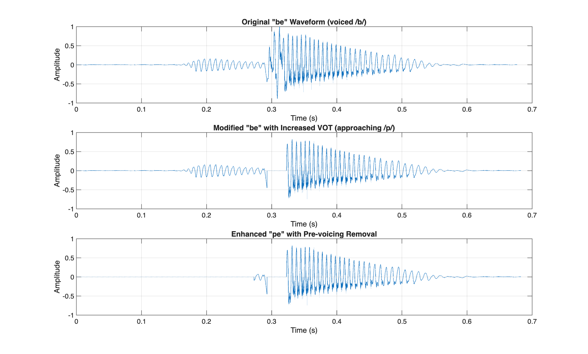
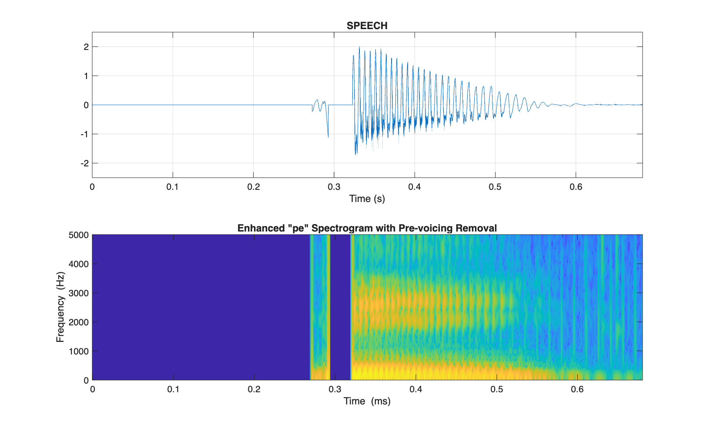
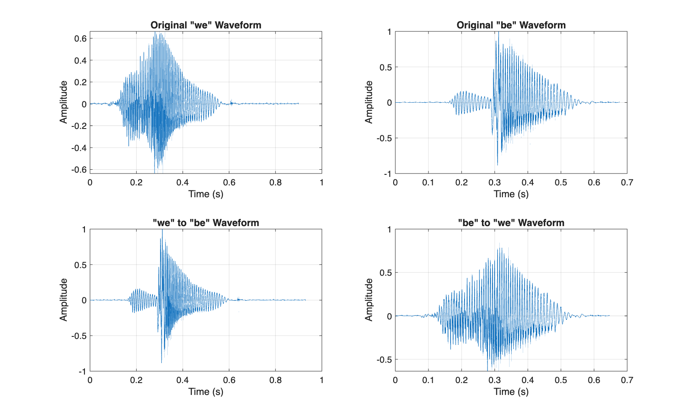
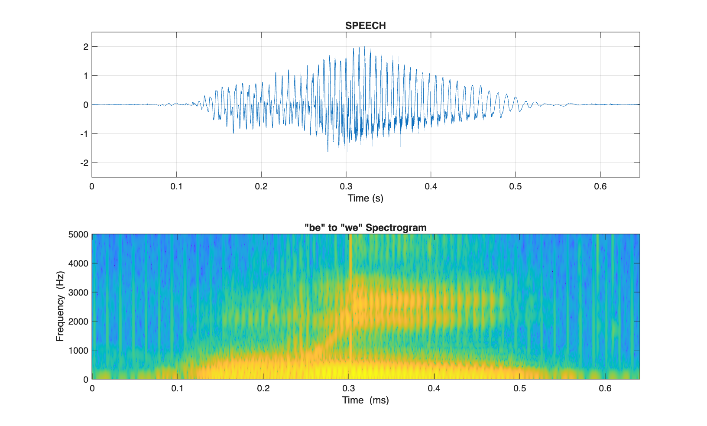

# Speech Signal Analysis - MATLAB Project

**Student:** Ahmed G. A. Qaddoura  
**Course:** Speech Recognition  
**Professor:** Mohammed Al Hanjouri  
**Islamic University of Gaza**

## Project Overview

This project implements spectral analysis, spectrogram visualization, and speech manipulation techniques using MATLAB. The implementation includes:

1. **Exercise 3.17**: Analyzing a speech segment using FFT with different window durations
2. **Exercise 3.19**: Creating spectrograms with various parameters and manipulating speech signals

## Key Results

### Spectral Analysis (Exercise 3.17)

#### Speech Waveform


#### Windowed Signals in Time Domain


#### Log Magnitude Spectrum with Different Window Durations


The 25 ms window provides better frequency resolution, which is more suitable for pitch estimation, while the 10 ms window offers improved time resolution at the cost of frequency precision.

### Spectrogram Analysis (Exercise 3.19)

#### Spectrograms with Different Window Durations

| Window Size | Frame Interval | Spectrogram |
|-------------|----------------|-------------|
| 20 ms (Narrowband) | 1 ms |  |
| 5 ms (Wideband) | 1 ms |  |
| 30 ms (Very Narrowband) | 1 ms |  |
| 3 ms (Very Wideband) | 1 ms |  |
| 3 ms (Extremely Wideband) | 0.5 ms |  |
| 20 ms | 5 ms |  |
| 30 ms | 5 ms |  |

#### Voice Onset Time (VOT) Modification

Original, modified, and enhanced "be" waveforms:



The spectrograms clearly show the progression from voiced /b/ to unvoiced /p/:



The enhanced version removes pre-voicing, creating a more convincing /p/ sound.

#### Phoneme Swapping

When swapping the initial phonemes of "we" and "be":



The spectrograms of original and swapped words:



## Setup and Execution

### Requirements
- MATLAB R2025a (or newer)
- Signal Processing Toolbox
- Data files: `ex3M1.mat` and `ex3M2.mat`

### Usage
1. Clone this repository:
   ```
   git clone https://github.com/AQaddora/speech-pitch-spectrogram-vot-analysis.git
   ```
2. Run Exercise 3.17:
   ```matlab
   ex3_17_solution
   ```
3. Run Exercise 3.19:
   ```matlab
   ex3_19_solution
   ```
   During execution, you will be prompted to:
   - Select burst and voice onset points in the "be" waveform (click two points)
   - Select the end of /w/ in "we" (click one point)
   - Select the end of /b/ in "be" (click one point)
   
   These interactive selections are crucial for accurate VOT modification and phoneme swapping.

4. Generated audio files and figures will be saved in the `data/` and `figures/` directories respectively.

5. Listen to modified audio files:
   ```matlab
   % Play original "be"
   [be_orig, fs] = audioread('data/be_original.wav');
   sound(be_orig, fs);
   
   % Play modified "be" with increased VOT
   [be_mod, fs] = audioread('data/be_modified.wav');
   sound(be_mod, fs);
   ```

## Implementation Notes

- Both scripts create `data/` and `figures/` directories if they don't exist
- Speech segments are analyzed using both narrowband and wideband approaches
- A wrapper function is implemented for the professor-provided spectrogram function
- Interactive selection is available for VOT modification and phoneme swapping

## Key Findings

1. **Window Duration Effects**: 
   - Long windows (≥20 ms): Better for frequency analysis and pitch estimation
   - Short windows (≤5 ms): Better for temporal events and transients
   - Very short windows (3 ms) with small frame intervals (0.5 ms): Ideal for precise timing of transient events

2. **VOT Manipulation**:
   - Increasing VOT can shift perception from voiced /b/ to unvoiced /p/
   - 30 ms VOT increase is sufficient to alter perception
   - Removing pre-voicing (vocal fold vibration before burst) further enhances /p/ perception
   - Combination of VOT increase and pre-voicing removal creates the most convincing transformation

3. **Phoneme Perception**:
   - Initial phoneme carries significant weight in word recognition
   - Successful phone swapping demonstrates importance of acoustic-phonetic features
   - Accurate boundary detection is crucial for natural-sounding phoneme substitution